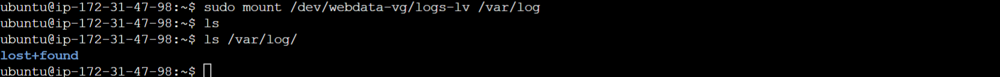

# Deploying a Web Solution with Wordpress

## Project Overview

This project aims to deploy a web solution using WordPress on Ubuntu servers hosted on Amazon EC2 instances. It involves setting up two EC2 instances, configuring block devices, creating logical volumes, installing WordPress, and configuring a MySQL database server.

## Prerequisites:

- Access to an AWS account with permissions to create EC2 instances and manage security groups.

- Basic familiarity with the Linux command line.

- Understanding of web server configurations and WordPress installation.

## Step-by-Step Implementation:

### Step 1 - Launch and Configure EC2 Instances:

- Create two Ubuntu EC2 instances and set the `Configure storage` to `10`.

- Configure Security group to allow inbound traffic on ports 22 (SSH) and 80 (HTTP) for the web server, and port 3306 (MySQL) for the database server.


## Step 2 - Create and Attach EBS Volumes:

- In the AWS Management Console, create three EBS volumes of 10 GiB each in the same AZ as the web server instance.

- Attach these volumes to the web server instance.


Note: `EBS` is an extra storage we attach to our server just as we attach external `Hard Disk` to our `local machine`.

Note: When creating `EBS` or external volume, `they must be in the same availability zone`. In this this case, we have `us-east-1d` as shown in the image below:


## Step 3 - Verify EBS Volume Attachment (Web Server):

- Connect to the web server instance (Remember to update your package first, once you connect - `sudo apt update`)

- Use the command below to list all block devices and verify that the attached volumes (`xvdbf`, `xvdbg`, `xvdbh`) are present.

```
lsblk
```


## Step 4 - Partition EBS Volumes (Web Server):

Create a single partition on each of the 3 disks using the `gdisk` command (The aim here is to create a logical partition)

```
sudo gdisk /dev/xvdbf
```

```
sudo gdisk /dev/xvdbg
```

```
sudo gdisk /dev/xvdbh
```

Refer to the gdisk [documentation](https://linux.die.net/man/8/gdisk) for detailed usage: gdisk documentation.

Follow the interactive prompts to create partitions, ensuring sufficient space for Wordpress installation.


`Note` do same for `xvdbg` and `xvdbh`

- Verify the partitions

```
lsblk

```


## Step 5 - Install LVM Package (Web Server):

Install the Logical Volume Manager (LVM) package using the following command:

```
sudo apt update
```

```
sudo apt install lvm2 -y
```

## Step 6 - Check Available Partitions (Web Server):

Use the command below to list all available physical partitions for LVM management.

```
sudo lvmdiskscan
```


## Step 7 - Create Physical Volumes (Web Server):

- Use the `sudo pvcreate` command to mark each of the newly created partitions as physical volumes (PVs) that LVM can use.

```
sudo pvcreate /dev/xvdbf1 /dev/xvdbg1 /dev/xvdbh1
```

- Verify the physical volumes by running the comand below. which will list all available PVs.

```
sudo pvs
```


## Step 8 - Create Volume Group (Web Server):

- Use the `sudo vgcreate` command to create a volume group (VG) named `webdata-vg` that will combine the three PVs.

```
sudo vgcreate webdata-vg /dev/xvdbf1 /dev/xvdbg1 /dev/xvdbh1
```

- Verify the volume group created using:

```
sudo vgs
```


## Step 9 - Create Logical Volumes (Web Server):

- Use the `sudo lvcreate` command to create two logical volumes (LVs) within the `webdata-vg` volume group:

  i. `apps-lv`: This will store your WordPress application files and allocate half of the total available space in the volume group.

  ii. `logs-lv`: This will store log data and use the remaining space.

```
sudo lvcreate -n apps-lv -L 15G webdata-vg # Adjust -L based on your needs
```

```
sudo lvcreate -n logs-lv -L 14G webdata-vg
```

- Verify the Logical Volumes created by listing all logical volumes using:

```
sudo lvs
```


## Step 10 - Format Logical Volumes (Web Server):

- Use the sudo mkfs.ext4 command to format the logical volumes with the ext4 filesystem:

```
sudo mkfs.ext4 /dev/webdata-vg/apps-lv
```

```
sudo mkfs.ext4 /dev/webdata-vg/logs-lv
```


## Step 11 - Create Mount Points and Mount Logical Volumes (Web Server):

- Create directories to serve as mount points for the logical volumes:

```
sudo mkdir -p /var/www/html # For WordPress files
```

```
sudo mkdir -p /home/recovery/logs # For log backups
```

- Mount the apps-lv logical volume to the /var/www/html directory, where your websites files will reside:

```
sudo mount /dev/webdata-vg/apps-lv /var/www/html/
```

Before mounting the logs-lv volume for log files: Use `rsync` to back up existing log files from `/var/log` to a secure location like `/home/recovery/logs`:

```
sudo rsync -av /var/log/. /home/recovery/logs/
```

- Hence, mount `/var/log` on `logs-lv` logical volume

```
sudo mount /dev/webdata-vg/logs-lv /var/log
```



- Now restore the previously backed-up logs from `/home/recovery/logs back to /var/log:`

```
sudo rsync -av /home/recovery/logs/. /var/log
```

## Step 12 - Update fstab File (Web Server):

Edit the `/etc/fstab` file using vi or another preferred text editor to ensure the mount points persist across reboots:

Extract the `UUID` of the device using

```
sudo blkid
```


- Add entries for the logical volumes, replacing UUID with your device UUID.

```
sudo vi /etc/fstab
```


- Save and close the `fastab` file

- verify that the mount configurations work as expected:

```
sudo mount -a
```

If you don't get any feedback this means the configuration is okay.

- Restart the systemd service to pick up changes:

```
sudo systemctl daemon-reload
```
